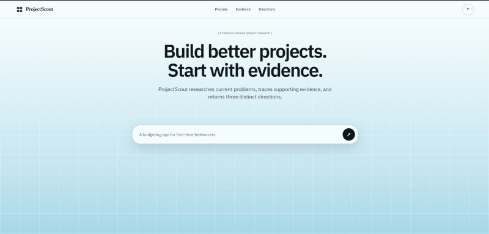

# ProjectScout

I recently watched a video about how innovation doesn't always mean creating something completely new. Sometimes, it starts with looking at something that already exists, noticing what frustrates people about it, and asking, "How could this be better?"

That idea stuck with me and eventually inspired my latest side project, ProjectScout.

ProjectScout helps you find project ideas by looking at what people are already discussing online. You enter a topic or an existing product, and it searches online sources for recurring pain points. It then turns those findings into three different project ideas, each supported by sources.

Honestly, I mainly built this as a learning project because I wanted to understand what it really takes to build and ship a full-stack application from scratch. Even though I used AI as part of the development process, I still learned much more than I expected, especially when it came to turning an idea into something people can actually use.

[Check out ProjectScout](https://lnkd.in/gE9Kcb2p)
